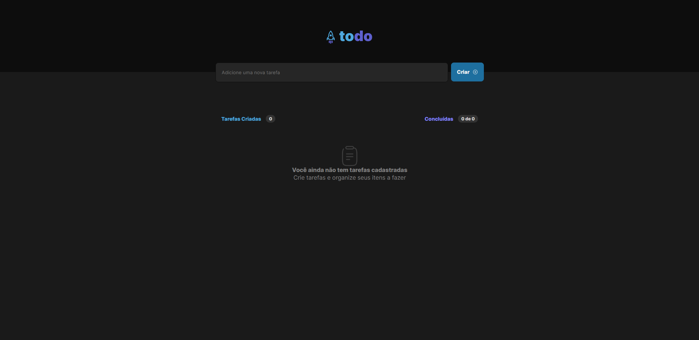
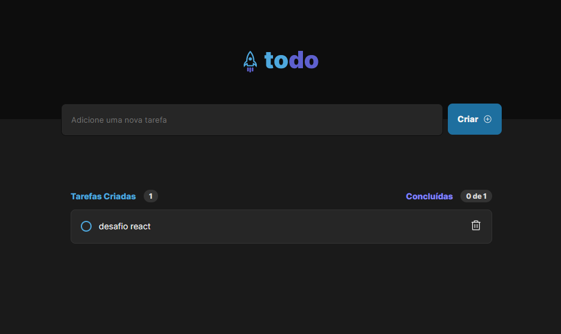

<h5>Projeto desenvolvido no curso IGNITE de REACTJS da RocketSeat.</h5>
Nesse desafio, <strong>criamos uma aplicação React utilizando o Vite e aplicando os conceitos mais importantes do React</strong>, entre eles estão <strong>componentização, propriedades, estados, imutabilidade e hooks, além de aplicar o TypeScript no projeto</strong> para adicionar tipagem estática.

## 🧪 Tecnologias

- [ReactJS](https://javascript.org/)
- [TypeScript](https://javascript.org/)
- [HTML](https://html.org/)
- [CSS](https://css.org/)

---

Made with ♥ by Ayrton Costa
